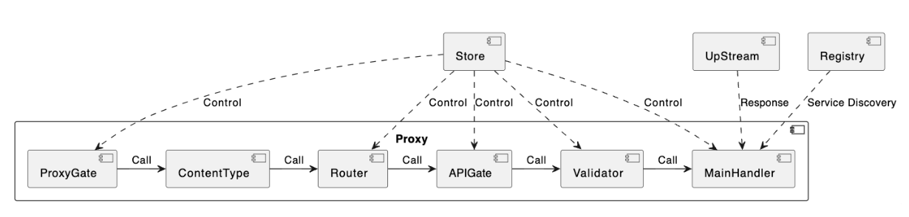

# Table of Contents

- [User Documentation](#user-documentation)
- [Design Documentation](#design-documentation)
- [Requirement Documentation](#requirement-documentation)
- [Software Engineering Highlights](#software-engineering-highlights)


# User Documentation

## Prerequisites
Install Nacos on your device. The easiest way to run it is using the image "nacos/nacos-server:2.0.3" in Docker. If your chip is ARM, use "centralx/nacos-server" instead.
   
If you are looking for alternative methods to install Nacos, refer to [Nacos Releases](https://github.com/alibaba/nacos/releases).

## Quick Start and Tutorial
1. Run Nacos. It is used for the service registration and discovery service.
2. Visit [CardWizard-Testing](https://github.com/yiwen101/CardWizard-Testing) and download the code.
3. Open the "CardWizard-Testing" folder, and then open the ARM or AMD folder **in your terminal** according to your device chip's type. You can see three entries in the folder: an IDL folder, a "gateway," and an "arith" binary executable. There should be 4 sample Thrift files in the IDL folder by default.
4. Run the gateway with `./gateway` **in your terminal**. It will read the 4 Thrift files in the IDL folder and provide API gateway service for them. 
If you get error message "./IDL does not exist", please make sure that you are running the gateway **in terminal** with the ARM or AMD folder as the working directory.
5. Run the RPC server for the "arithmetic" service with `./arith` **in your terminal**. It will automatically register itself to a Nacos server by asking the Operation system the address of the Nacos server. So please make sure that the Nacos server is running (step 1).
6. The API Gateway is set. Now it generates routes for all methods parsed from the thrift file in "GET ${gateway address}/proxy/:serviceName/:methodName". For example:

   ```bash
   curl --location --request GET '127.0.0.1:8080/proxy/arithmetic/Add' --header 'Content-Type: application/json' --data-raw '{"firstArgument":100, "secondArgument": "17", "extraField":"extra"}'
    ```
Will get an error-free response 

   ```bash
   {"firstArgument":100,"secondArgument":17,"result":117}
   ```
7. To run the web UI, first to install the serve package by running
   ```bash
   npm install -g serve
   ``````
8. Go to the directory “User Interface” under the “CardWizard-Testing” folder, and run 
   ```
   “serve -s build”
   ```
   You should be able to see something like this in the terminal:
   
9.  copy the address and port number (in this case, it is http://localhost:3000) and visit it with your browser. Have fun exploring its functionalities!

10: Additional note: when you make an edit in the web UI, a “withdraw” button will be available for a few seconds in case you want to undo the last modification. To support this, UI will actually wait for a few seconds before sending the modification request to the server. So you may see some delay between making the modification on the web UI and witnessing a real change to the API Gateway server’s behavior.

## Key terms and functionalities:
### ServiceName and MethodName
The “serviceName” and “methodName” are parsed out of the name inside the Thrift file. For example, the “serviceName” and “methodName” for the file below are NoteServie and CreateNote respectively.


We did not choose to set the “serviceName” by the thrift file name or the “namespace” inside the file. This is because we hope to make our “serviceName” align to the “Name” attribute of the “serviceDescriptor” parsed from the IDL file. 
### ClusterName
The cluster name is used to find the RPC server cluster in the Nacos server. It should align to the name the upstream RPC server uses.

For example,this is a piece of code from an upstream RPC server. The cluster name for it should be “arithmetic”


The Default cluster name is the name of the Thrift file without the “.thrift” extensions. 
For example, this piece of code is from the  “note.thrift” file, then the cluster name for the “BizService” service is “note” by default.


We design this default value mechanism with a reason. IDL files are written by the teams responsible for that service as a means of communication of the service's information. So the name of the file is likely to be the name used by the RPC server of that service. 

### LoadBalanceOp
Currently there are only two load balance strategies available: “weighted round robin” and “weighted random”. 

The default option is “weighted round robin” as it is more stable option than the random algorithm.

### IsSleeping

When an API’s isSleeping is on, the gateway will stop providing the gateway service. All the routes for this API will respond “404” afterward. This field is false by default.

We design the isSleeping field in API to support stop serving an API. This is not easy without this field as API are auto-generated by parsing the IDL file and can not be created and deleted directly.

A service’s isSleeping value is an indication of whether all its APIs isSleeping. The value is false when there is at least one method (APIs) not sleeping. This field should be false by default as API’s isSleeping is false by default. 

We design this field in the Service as a “syntax sugar” for turning on/off all the APIs under it. This field is not necessary from the functionality perspective and is purely for the user experience.


### ValidationOn
When “validationOn” is true, a validator will recursively validate the incoming JSON body for all requests against the descriptor parsed from the IDL file of that method. If the validation is not successful, it will not forward the request to the main handler and return an error message indicating the issue that leads to failure of validation. Error message highlighting the type mismatch for the argument passed in.

We design this as the JsonThrift generic call does not handle JSON body validation properly by default. For example, it will assume zero value for missing non-optional fields and assume strange values when a field’s type is wrong. The tables below highlight the difference in the gateway’s behaviors with and without validator:


The default value for this field is false due to performance consideration.

### HTTPmethod and url: 
For all services in the IDL file, it will automatically register each method of it with route /:serviceName/:methodName under the GET method when the gateway first starts.

You can easily add, delete and modify routes via our web UI.

### Proxy

Proxy is a synonym for the API Gateway service in our project. You need to use {HTTP method} {address}/proxy/${routePath} to access the upstream resources. For example, “GET 127.0.0.1:8080/proxy/arithmetic/Add”.

 Proxy can be taken as a chain of handlers where each node calls the next in the chain only when the request passes its test. Router and MainHandler are the most important sub-components for the proxy component.


### Admin
Admin offers RESTful APIs to access and manage the gateway’s information. 

The list of useful APIs currently provided by the admin are:

|HTTP Method|URL|Response JSON|Request JSON
|-|-|-|-|
|GET|/admin/service|Array of serviceInfo|N/A
|GET|/admin/service/:id|serviceInfo|N/A
|POST|/admin/service|serviceInfo|serviceInfo
|PUT|/admin/service/:id|serviceInfo|serviceInfo
|DELETE|/admin/service/:id|Success string|N/A
|GET|/admin/route|Array of RouteInfo|N/A
|GET|/admin/route/:id|The RouteInfo|N/A
|POST|/admin/route|RouteInfo|RouteInfo
|PUT|/admin/route/:id|RouteInfo|RouteInfo
|DELETE|/admin/route/:id|Success string|N/A
|GET|/admin/api|Array of apiInfo|N/A
|GET|/admin/api/:id|apiInfo|N/A
|PUT|/admin/api/:id|apiInfo|apiInfo


### Pprof
Pprof is a popular profiling tool in go.
You can visit localhost:${same port as your gateway}/debug/pprof after running the gateway to view its profile.

## Command line flags 
For the “gateway”, You could use the “addr” flag to customize the address the gateway server will be operating on, and the “idl” flag to customize the relative path to the folder containing all the IDL files.
For the “arith”, you can use the “port” flag to set the port it will operate on, so that you can run multiple instances on the same server on different ports.

This Table provides a summary of the flags supported.
|File|Flag|Default|Explaination|
|-|-|-|-|
|gateway|addr|127.7.7.1:8080|http request entrypoint
|gateway|idl|./IDL|relative path to the IDL folder
|arith|port|8888|port for the arithmetic service

For the web user interface, you need to update the .env file inside the “User Interface” folder after customizing the address of the gateway server when you use the Web GUI. After open the .env i you can see:
   ```
   REACT_APP_Gateway_Address='http://127.0.0.1:8080'
   ```

You need to reset the value of REACT_APP_Gateway_Address to your customized server address for the GUI to work.

## Link to other resources

[]

***
***

# Design documentation
## Overall Architecture:

There are three components in the API Gateway: Admin, Proxy and Store.

The Proxy component contains the logic for API Gateway. The Store component is responsible for controlling the behavior of the Proxy, and the Admin component provides RESTful APIs for performing CRUD to the Store component, and hence enables runtime modification of the Proxy’s behavior. UI is a sub-project that offers a web graphical user interface to the user. 

For now, our API Gateway only accepts Thrift IDL files, utilizes Nacos service registry and discovery center, and upstreams RPC servers need to support generic calls and register themselves to the Nacos server. 

## Component Details:
### Proxy Component


The Proxy component is responsible for the main logic of the API Gateway. It can be taken as a chain of handlers where each node calls the next in the chain only when the request passes its test. Router and MainHandler are the most important sub-components for the proxy component.

The Router is responsible for decoding the incoming HTTP requests to determine the corresponding service and API. 

The MainHandler is responsible for routing the request to the RPC server. It gets the list of RPC servers from Nacos, uses the load balancing strategy to pick a server, make a generic call to that server using a generic client generated by parsing the corresponding IDL file, and finally forwards the response back to the user.

The ProxyGate control whether the gateway service is available, ContentTypeHandler ensures the incoming http requests are with a supported body type (currently only application/JSON is supported), APIGate controls whether an API is available, and validator use the service descriptor parsed from IDL files to validate the incoming JSON body. 

Most sub-components are controlled by the Store component.

### Store Component
Store is responsible for controlling the Proxy component. The following gives the APIs of the Store component.


“ //xxx ” after each line means “xxx” package registers a listener to the “UpdateEvent” occurring at that field. This is also the mechanism that the Store component uses to control the behavior of the Proxy component.

Store is concurrently safe.

### Admin Component
Admin component is responsible for offering RESTful APIs to the external to perform CRUD on the Store component and hence achieve dynamic updation of the Proxy component. The list of API currently provided by the admin are:

|HTTP Method|URL|Response JSON|Request JSON
|-|-|-|-|
|GET|/admin/service|Array of serviceInfo|N/A
|GET|/admin/service/:id|serviceInfo|N/A
|POST|/admin/service|serviceInfo|serviceInfo
|PUT|/admin/service/:id|serviceInfo|serviceInfo
|DELETE|/admin/service/:id|Success string|N/A
|GET|/admin/route|Array of RouteInfo|N/A
|GET|/admin/route/:id|The RouteInfo|N/A
|POST|/admin/route|RouteInfo|RouteInfo
|PUT|/admin/route/:id|RouteInfo|RouteInfo
|DELETE|/admin/route/:id|Success string|N/A
|GET|/admin/api|Array of apiInfo|N/A
|GET|/admin/api/:id|apiInfo|N/A
|PUT|/admin/api/:id|apiInfo|apiInfo

And the mentioned data type serviceInfo, RouteInfo, apiInfo are :


## Working Flow


At run time, when a user sends a HTTP request to the API Gateway, the gateway will first check whether the content type is valid. If it is not valid, it will make an error response, otherwise, it will call the router

Router will find the matching api for the incoming request, It will make an error response if the route is not valid, and call the BodyValidator with route information otherwise. 


By default the validator is off and directly calls the main handler. But if it is set to be on, it will validate the JSON body recursively against the method’s function descriptor. The validator makes an error response if the validation fails or calls the main handler otherwise.

The generic client will ask for a list of hosts from Nacos service registry and discovery center, choose one server from the list according to its load balancing strategy, make a generic call to the server, and finally forward the response back to the user.


***
***


# Requirement documentation
## User stories:
### Title: Manage API Gateway Services and Methods
#### Requirements

As a DevOps engineer responsible for API Gateway management in an organization using IDL files as the means of communication of APIs between teams,

I want to be able to easily and dynamically manage the gateway where the gateway parses the IDL files to autocomplete as much work as possible. 

I also need the ability to modify the gateway’s behavior at runtime without the need to stop the server.

I would like an intuitive interface to manage the gateway, so that I can quickly and effortlessly perform tasks on checking, adding, updating, and delete services and their options as needed. Documentation and code examples are demanded where an intuitive interface is not available.

I might appreciate additional plugins and middleware or an open architecture for external plugins if I need to customize the gateway to satisfy demands.

#### Acceptance Criteria
Scenario: View Currently Running API Gateway Services and Methods

Given I am a DevOps engineer with access to the API Gateway interface

When I run the API Gateway

Then the interface should display the details of all currently running services and methods.

And I should be able to view the service name, routes, and handler options for each method.
***
Scenario: Add a New Service

Given I am a DevOps engineer with access to the API Gateway interface,

When I choose to add a new service,

Then the system should prompt me to provide the necessary information for the new service.

And upon providing the IDL file, a new service should be added to the service list.

And the service name, routes, and handler options for each method should be generated with default settings the API Gateway.
***
Scenario: Delete a Service

Given I am a DevOps engineer with access to the API Gateway interface,

When I select a service from the service list and choose to delete it,

Then the service should be removed from the service list.

And a message should be displayed to notify me of the action's success, and the proxy’s behavior change accordingly
***
Scenario: Update Service Options

Given I am a DevOps engineer with access to the API Gateway interface,

When I select a service from the "service" list and choose to update its options/IDL

Then the system should prompt me to input the new option settings accordingly.

And the displayed options in the service/api list updated accordingly

And a message should be displayed to notify me of the action's success, and the proxy’s behavior change accordingly
***
Scenario: Manage Methods at Multiple Levels

Given I am a DevOps engineer with access to the API Gateway interface,

When I select a service from the service list,

Then I should have the option to perform "add," "sleep," "awake," and "update" actions at the method level (api) or for the entire service (all methods) level of the chosen service.
***
Scenario: Usability of the API Gateway

Given I am a DevOps engineer with access to the API Gateway interface

When I need to utilize a function of the API Gateway
Then I either have access to an intuitive graphical user interface

Or access to detailed documentation with sample code/demonstration 

And the amount of coding done by me is minimal

### Title: Using the API Gateway 
#### Requirement:

As a client interacting with the API Gateway by sending HTTP requests

I want to access the service offered by the upstream servers by sending HTTP requests (with JSON encoded bodies) to the gateway

I need to know the map between routes and APIs to craft the request

I hope that the Gateway provide informative error messages when error occurs

#### Acceptance Criteria:

Scenario: Sending valid HTTP Requests with JSON-Encoded Bodies

Given I am a client using the API Gateway,

When I need to access a specific service provided by the upstream servers and send a valid HTTP requests including JSON-encoded bodies containing the necessary data for the request to the API Gateway

Then the gateway should route my request to the correct upstream server

And parse the JSON data and extract the required parameters according to the method options defined for the service and method. 

And make an RPC call to the corresponding upstream server based on the service and method information obtained from the request path.

And provide informative error messages that clearly describe the nature of the error, helping me understand the issue and troubleshoot effectively.


Scenario: Crafting HTTP Requests with JSON-Encoded Bodies

Given I am a client using the API Gateway,

When I need to access a specific service provided by the upstream servers by crafting a valid HTTP requests including JSON-encoded bodies containing the necessary data for the request to the API Gateway

Then I could refer to a map between routes and apis, and the required structure for the JSON body.

And I could receive informative error messages for errors caused by the wrong routes or invalid JSON body


## Features:
### Proxy Service
A reverse proxy that accepts HTTP requests with JSON-encoded bodies with a server and forwards requests to backend RPC servers according to route.

Generic-Call feature by translating JSON requests into Thrift binary format using the kitex’s generic package.This ensures support across programming languages.

Integrate Nacos service registry and discovery for the API Gateway and RPC servers.

Integrate the Kitex build-in load balancing solutions to the generic clients to distribute requests among backend RPC servers.

Develop backend RPC servers using Kitex for testing the API Gateway.

Automatic routes and handler generations from IDL files. This does not only provide users with the ease of running a robust gateway at one click without any coding, but also provides a mechanism for easily updating the relationship between services and IDLs, ensuring that the API Gateway can adapt to changes in case of new services and IDL update.

Implement validators that by recursively checking the fields/types in the json encoded body against the corresponding function/struct/type/field descriptors parsed from the IDLs. Should there be a fatal mismatch, the gateway will make a response with the problematic field/type identified and not pass the request to the upstreams. This does not only support proper error handling and debugging of the client, but also reduces unnecessary traffic to the upstream RPC servers.
This plugin is not active by default. 

### Admin Service
The admin service offers a set of REST style APIs for checking, adding, modifying and deleting services, apis, routes metadata/options/status.  Clients can use this set of APIs to access information and/or modify the behavior of the proxy service dynamically in a concurrency safe manner. The entire user interface is built depending on the admin service.

### Web User Interface
Support live listing of all registered services, apis, routes and options/status informations

Support searching in the service/api/route lists

Support easy adding/reloading service from IDL in run time

Support easy modification of service, api options/status in run time

Support easy deletion and bulk deletion of services and routes in run time

Support easy adding and modification of routes in run time

Support export of all routes in csv file

Support withdrawal of latest adding/modification/deletion request a few seconds after the action by delay sending request to the server, coupled with optimistic local updation.

      
### Potential extensions

Implement rate limiting to prevent abuse of the API Gateway.

Add authentication and certificate validation mechanisms to the API Gateway.

Implement support for json-protobuf generic call in our gateway by implementing the JSON to Protobuf codec


***
***

# Software Engineering Highlights
## Software Engineering Principles
### Open Close Principle
The Open-Closed Principle requires that classes should be open for extension and closed to modification. This means that we should be able to add new functionality without touching the existing code for the class. 

Take the demolished “Service” package for example, it used to violates the open close principle like this:(the client was in lexical scope for efficiency purposes). 


This violates the open close principle. There is no room for adding new functionality without editing the inner of the handler. Imagine using the “handlerManager'' to generate the handlers for “PUT /admin/service” in this way and hard coding all the pkg that need to react to the new PUT request, and all the logic in identifying what to perform with each field updation result  and whether the request is valid and so on. What a nightmare.

The “store” package fulfills the open close principle with the event listener pattern.

If a new package needs to perform some actions when a particular field is modified, the package just needs to import the Register function of that field from the Store package, pass in a function capturing the actions to be taken as argument to it, and the Store package will do the rest. And the call to all the registered handlers will only be made when there is a successful update. Then, the admin package’s handler can simply call the methods to modify the store without the needs to concern all the updating logics, and a new package can be updated as needed without the need to change the code of the Admin or Store package, just pass a EventHander to the store’s registry method will suffice.
 

Needless to say, this principle has significantly improved the extensibility of the code.

### Single Duty Principle:
The Single Responsibility Principle means a class should have one, and only one, reason to change. 
In our code in milestone 2, we did not fulfill this principle well as we group functionality to where it appears to come handy. For example, our client manager load clients by parsing the thrift files in the IDL folders when the server initialize.The issue is that the client manager does not only need to manage the map of services to clients, but also needs to care about the logic of building a descriptor from IDL files, which becomes troublesome when we wish to extend beyond just a thrift file. It also needs to care about initializing all the clients before the Hertz server runs, which brings in issues like what is the relative path to the thrift folders and so on. We also almost added handle call functionality to the client manager, as it appears to make sense. Well, clients are here to make calls to the upstream, so it appears to be the right place to add that functionality. This can not be more wrong.
We bumped into many troubles when we attempted to add the “runtime update” functionality to our API gateway due to the mess brought about by this “put function at where it is most handy” practice. A failing remedy strategy is to make each “manager” as “powerful” and close to the end points as possible and dump functionalities in it. Yet we only find ourselves in greater chaos when we wish to add new features. 

By the time of writing, we have applied the Single Duty Principle to refractor our code for the API Gateway. We demolished the “client” package into “caller” package which has only one duty: keep clients up to date with “Store”. The only method it exports outside is “GetClient”, and it no longer concerns the handle of request, nor does it parsing the IDL file itself, or need to explicitly concern with initializing all the clients. Its single duty is to maintain consistent client maps with what is stored in the “Store”. The “caller” package has almost become a runtime plugin to the “Store” package

We have also carefully designed all the components in the API Gateway to fulfill the single duty principle, and are awarded with a clarity of mind.

### Dependency Inversion Principle
The Dependency Inversion principle states that our classes should depend upon interfaces or abstract classes instead of concrete classes and functions.

The mainHandler in the proxy demonstrates the benefit of the dependency inversion principle. The generciclient.Client class (or struct) offered by Hertz does not support pointer receiver, which means that if our caller returns generciclient.Client, golang will costly create a copy of the whole struct and return the copied struct. A million calls to the GetClient method means copying the struct a million times which is unacceptable. 

But fortunately the mainHandler does not depend on the “genericclient.Client” class  but (explicitly)  an interface implementing “GenericCall”. Therefore I could make a wrapper class myClient that supports a pointer receiver to solve the issue. There will be only one copy of the generciclient.Client struct per client in the main memory no matter the number of calls to the “GetClient '' method (which returns pointer pointing to a struct with the copied struct as a field)
 

While options like keeping a single client in the lexical scope of the returned handler (which we did in milestone 2) or include the call method in the caller package (which we considered when trying to support runtime modification of the handler) could also solve this issue, but they are rejected as they contradicts to the open closure principle and single duty principle respectively.

### Do not Repeat yourself Principle
When we feel like copying and pasting code, we refactor the code writing a reusable  function to avoid repeating ourselves. For example in the admin_test file, we group the code of making a call into the callWithBody function. It turns out this does not only reduce the amount of code, but also significantly boost the clarity of mind during debugging.
 
 
## Testing:
### Unit Testing:
Every package has its own unit testing. We aim at full coverage.
Eg: this is part of the test for the “ValidateBody” method in the Validator submodule
 

### Integration Testing:
With the help of the “github.com/cloudwego/hertz/pkg/common/ut" package, we can directly interact with the “Engine” component in a Hertz server and write integration tests to test the behavior of the server upon receiving a HTTP request.

We provide the code for a Kitex RPC server implementing the “arithmetic.thrift”  in the “testing” folder. The RPC server needs to be on during the test. It will respond to the RPC calls made by the Hertz Engine during the test.
 
We also did some simple integration test via manually trying HTTP requests via Curl

### Load Testing

We did load tests via Jmeter. In the load test, we stimulate 1000 clients that incessantly sending requests for one minute (with a total of 143,996 requests)
 

The error leads to failure is “middlewares.go:130: [Warn] KITEX: auto retry retryable error, retry=1 error=remote or network error: get connection error: dial tcp 192.168.199.77:8385: i/o timeout”
## Other practices:
### Planning:
During the period of milestone three, we adopt multiple agile development techniques in our development.They are the use of user story and task cards in place of traditional requirement documentation, test-driven development process, active refactoring and incremental development based on scenarios.

When adding a new feature, we first identify a scenario in mind, then describe it,  add in details and finally craft out a set of measurable test cases. This does not only help us to be more goal oriented by having a clean end in mind, but also enables a better understanding of the requirement during the process of generating the test case.
### Documentation:
Refer to “User Cases and Features”, “User Documentation” and “Design Documentation”. We also have comments in the code where helpful.

### Error Handling:
We carefully differentiate errors between fatal errors and non-fatal errors to make sure that the server will only shut down when there is a fatal error.
### Coding standard:
https://github.com/uber-go/guide/blob/master/style.md (uber go style guide)
### Restful API design:
Web API design best practices - Azure Architecture Center | Microsoft Learn
### Project layout:
https://github.com/golang-standards/project-layout

